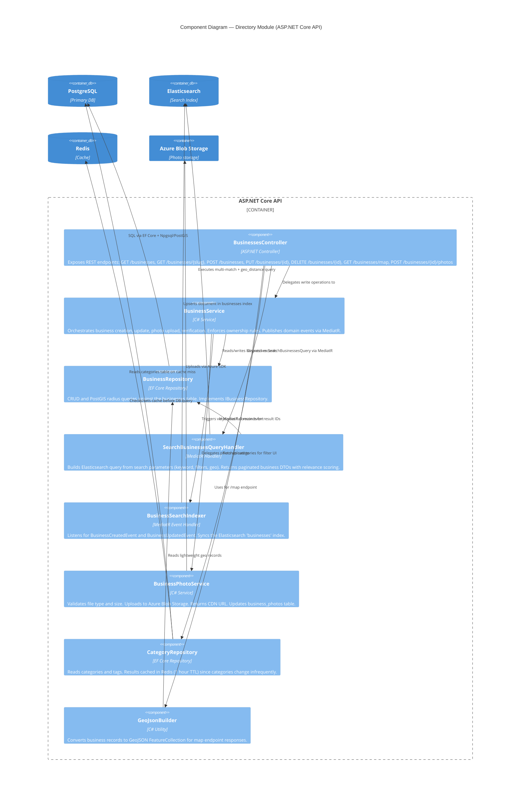
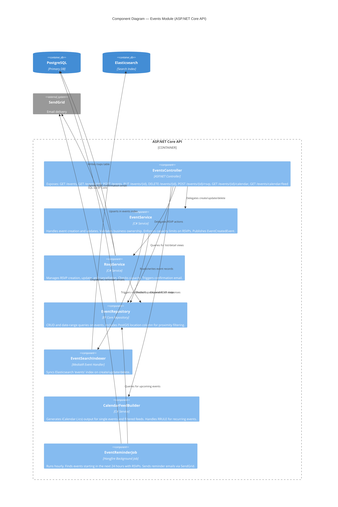
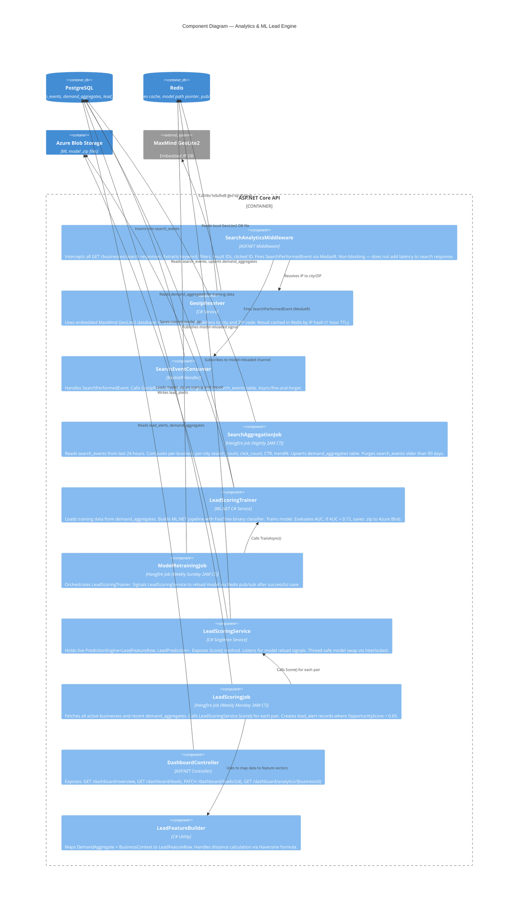
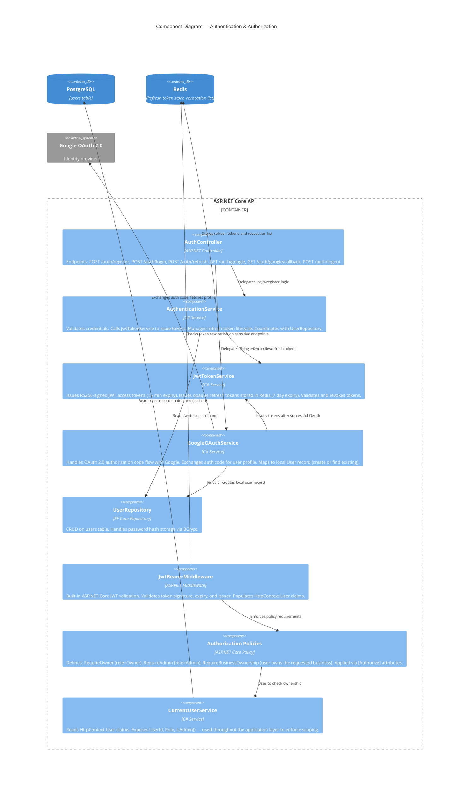
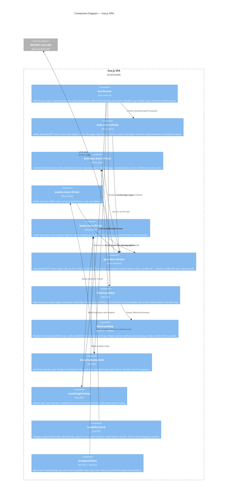

# C4 Level 3 — Component Diagrams: CowetaConnect

> **C4 Model Level:** 3 — Components  
> **Purpose:** Shows the internal components of each major container and how they interact.  
> **Audience:** Developers building or maintaining CowetaConnect.

---

## 1. ASP.NET Core API — Directory Module



---

## 2. ASP.NET Core API — Events Module



---

## 3. ASP.NET Core API — Analytics & ML Module



---

## 4. ASP.NET Core API — Auth Module



---

## 5. Vue.js SPA — Component Architecture



---

## Cross-Component Request Trace: Business Search

This trace shows the full path of a single user search across all component layers.

```
User types "honey" + selects Wagoner filter
        │
        ▼
SearchBar.vue (emits 'search' event with params)
        │
        ▼
DirectoryView.vue (handles event, calls business.store.search())
        │
        ▼
business.store.ts → business.service.ts → api.client.ts
        │
        ▼  GET /api/v1/businesses?q=honey&city=wagoner
ASP.NET Core API
        │
        ├── [SearchAnalyticsMiddleware intercepts — async, non-blocking]
        │       └── Fires SearchPerformedEvent via MediatR
        │               └── SearchEventConsumer → GeoIpResolver → write search_events row
        │
        ├── BusinessesController.Search()
        │       └── Dispatches SearchBusinessesQuery via MediatR
        │               └── SearchBusinessesQueryHandler
        │                       ├── Builds Elasticsearch query (multi-match + city filter)
        │                       ├── ES returns top 20 matching IDs + scores
        │                       └── BusinessRepository hydrates full records from PostgreSQL
        │
        └── Returns 200 OK — paginated JSON
                │
                ▼
business.store.ts ← updates businesses state
        │
        ▼
BusinessGrid.vue re-renders with new results
BusinessMap.vue updates markers
```

---

## Component Interaction: ML Lead Generation (Weekly Cycle)

```
[Sunday 2:00 AM CT — ModelRetrainingJob]
        │
        ▼
LeadScoringTrainer.TrainAsync()
  ├── Reads demand_aggregates (PostgreSQL)
  ├── Maps rows → List<LeadFeatureRow>
  ├── Builds MLContext pipeline (Normalize + FastTree)
  ├── Trains model on 80% split
  ├── Evaluates on 20% split → logs AUC, F1, Precision
  └── If AUC > 0.72:
        ├── Saves model to Azure Blob: /ml-models/lead-scoring-20260218.zip
        └── Publishes "model:reloaded" to Redis pub/sub

[LeadScoringService receives Redis message]
  └── Swaps PredictionEngine<> via Interlocked.Exchange (zero downtime)

[Monday 3:00 AM CT — LeadScoringJob]
  ├── Fetches all active businesses (PostgreSQL)
  ├── Fetches recent demand_aggregates (PostgreSQL)
  └── For each business × demand_city pair:
        ├── LeadFeatureBuilder.Build() → LeadFeatureRow
        ├── LeadScoringService.Score() → LeadPrediction
        └── If OpportunityScore > 0.65:
              └── Upsert lead_alerts (PostgreSQL)
                      └── Owner sees new alert on Dashboard next login
```
