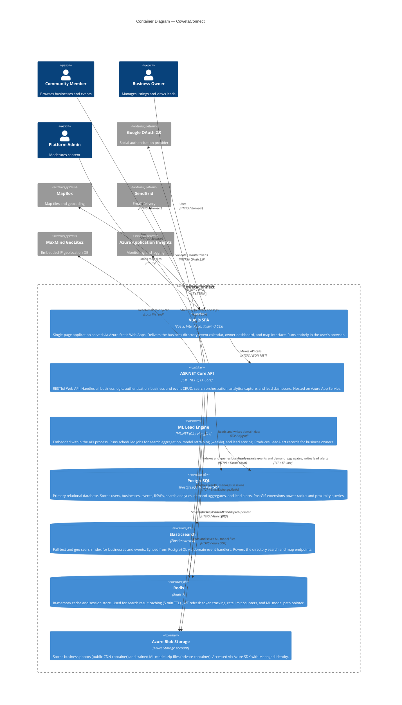

# C4 Level 2 — Container Diagram: CowetaConnect

> **C4 Model Level:** 2 — Containers  
> **Purpose:** Shows the major deployable units (containers) inside CowetaConnect and how they communicate.  
> **Audience:** Technical team — architects, developers, DevOps.

---

## Diagram



---

## Container Descriptions

### Vue.js SPA
The user-facing application. Served as static files from **Azure Static Web Apps** — globally cached via CDN. Contains all views: business directory, map, event calendar, owner dashboard, and admin panel. Communicates with the API exclusively via REST over HTTPS.

**Key responsibilities:**
- Render business listings, map pins, and event calendar
- Manage local UI state via Pinia stores
- Handle auth flows (JWT storage in memory, refresh via httpOnly cookie)
- Display lead alert cards and analytics charts for owners

**Does NOT:**
- Execute any business logic
- Directly access any database
- Store sensitive data in localStorage

---

### ASP.NET Core API
The backend brain of the platform. A **Modular Monolith** — organized into four vertical modules (Directory, Events, Analytics, ML) within a single deployable ASP.NET Core 8 process.

**Key responsibilities:**
- Enforce authentication and authorization (JWT + RBAC)
- Serve business search and GeoJSON map endpoints
- Orchestrate photo uploads to Blob Storage
- Capture search analytics via middleware
- Expose the owner dashboard and lead endpoints
- Host Hangfire for background jobs

**Hosted on:** Azure App Service (B2 for MVP, P1v3 for growth)

---

### ML Lead Engine
Not a separate service — **embedded within the API process** as a set of Hangfire background jobs and in-process ML.NET services. This eliminates cross-service latency and deployment complexity at the current scale.

**Key responsibilities:**
- Nightly: Aggregate `search_events` → `demand_aggregates`
- Weekly: Retrain the FastTree binary classifier using latest demand data
- Weekly (post-retrain): Score all active business × demand_city pairs, write `lead_alerts`

**Extraction path:** If scale demands it, the ML Engine can be extracted to a separate Azure Function or Container App by replacing `ILeadScoringService` with an HTTP client implementation. The interface is already abstracted.

---

### PostgreSQL (+ PostGIS)
The source of truth for all structured data. PostGIS geography columns enable efficient radius queries (`ST_DWithin`) for the "businesses near me" feature.

**Key tables:** `users`, `businesses`, `categories`, `events`, `rsvps`, `search_events`, `demand_aggregates`, `lead_alerts`

---

### Elasticsearch
Secondary data store, purpose-built for search. Receives data via domain event handlers whenever businesses or events are created or updated. Powers the directory search bar (relevance ranking, fuzzy matching, faceting) and the map GeoJSON endpoint.

**Indexes:** `businesses`, `events`

---

### Redis
Ephemeral cache layer. Not used as a primary store — all data in Redis can be regenerated from PostgreSQL if needed.

**Usage:** Search result cache (5 min TTL), rate limit counters, current ML model path, CSRF token store.

---

### Azure Blob Storage
Two containers:

| Container | Access | Contents |
|---|---|---|
| `photos` | Public (CDN) | Business photos served at `cdn.cowetaconnect.com/photos/...` |
| `ml-models` | Private | ML.NET `.zip` model files, named by date |

---

## Communication Patterns

| From | To | Protocol | Sync/Async |
|---|---|---|---|
| Browser | Vue SPA | HTTPS | Sync |
| Vue SPA | ASP.NET API | HTTPS REST | Sync |
| ASP.NET API | PostgreSQL | TCP (Npgsql) | Sync |
| ASP.NET API | Elasticsearch | HTTPS | Sync |
| ASP.NET API | Redis | TCP | Sync |
| ASP.NET API → Analytics | PostgreSQL | MediatR (in-process) | Async (fire-and-forget) |
| Hangfire Jobs | PostgreSQL | TCP (EF Core) | Async (scheduled) |
| Hangfire Jobs | Blob Storage | HTTPS | Async (scheduled) |

---

## Deployment Topology

```
┌─────────────────────────────────────────────────────────────┐
│                    Azure Front Door (WAF)                    │
│              cdn.cowetaconnect.com  /  api.cowetaconnect.com │
└────────────────────┬───────────────────────┬────────────────┘
                     │                       │
          ┌──────────▼────────┐   ┌──────────▼────────────┐
          │ Azure Static      │   │ Azure App Service      │
          │ Web Apps          │   │ cowetaconnect-api-prod │
          │ (Vue SPA)         │   │ (.NET 8)               │
          │ Global CDN cache  │   │ + Hangfire workers     │
          └───────────────────┘   └──────────┬─────────────┘
                                             │ VNET Integration
                               ┌─────────────┼──────────────┐
                               │             │              │
                    ┌──────────▼──┐  ┌───────▼────┐  ┌─────▼──────┐
                    │ PostgreSQL  │  │Elasticsearch│  │   Redis    │
                    │ Flexible    │  │(Elastic     │  │ Azure Cache│
                    │ Server      │  │ Cloud)      │  │            │
                    └─────────────┘  └────────────┘  └────────────┘
```

All data-tier resources are **VNET-integrated** — they have no public internet endpoints. The App Service connects to them via private virtual network.
