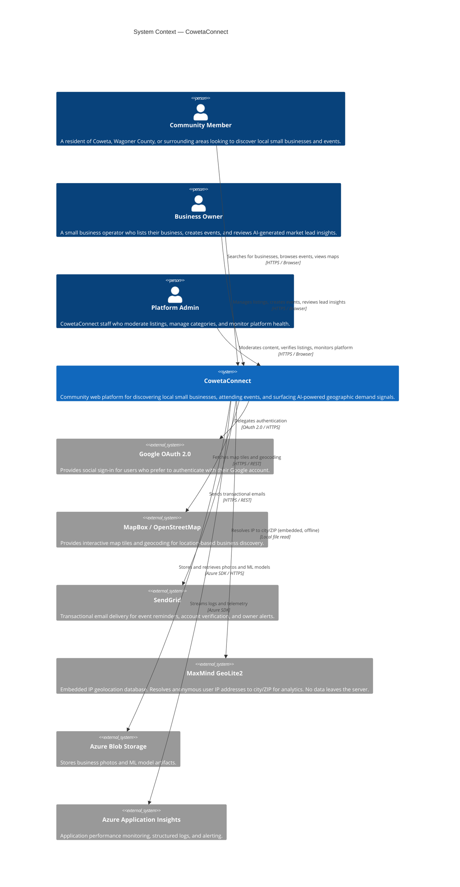

# C4 Level 1 — System Context: CowetaConnect

> **C4 Model Level:** 1 — System Context  
> **Purpose:** Shows CowetaConnect as a black box and how it relates to its users and external systems.  
> **Audience:** All stakeholders — technical and non-technical.

---

## Diagram

---

## Narrative

### What is CowetaConnect?

CowetaConnect is a **community web platform** serving Coweta, OK and the wider Wagoner County region. Its core purpose is threefold:

1. **Business Discovery** — Residents can find local small businesses by category, keyword, location, or map.
2. **Event Calendar** — Business owners can publish workshops, pop-ups, markets, and community events that residents can browse and RSVP to.
3. **AI Market Intelligence** — The platform passively observes search patterns and uses ML to surface geographic demand signals to business owners — identifying cities with high search interest where a business has low visibility.

### Who uses it?

| Actor | Primary Goal | Account Required? |
|---|---|---|
| Community Member | Find local businesses, discover events | No (read-only browsing is anonymous) |
| Business Owner | Grow their business, manage presence, understand demand | Yes (Owner role) |
| Platform Admin | Keep content accurate and platform healthy | Yes (Admin role) |

### External Dependencies

| System | Role | Data Shared |
|---|---|---|
| Google OAuth 2.0 | Optional social sign-in | Email + display name (one-time, on registration) |
| MapBox / OpenStreetMap | Map rendering, geocoding | Business coordinates (public) |
| SendGrid | Email delivery | Recipient email, event name, date |
| MaxMind GeoLite2 | IP → City/ZIP resolution | **Embedded locally** — no data leaves the server |
| Azure Blob Storage | Photo and ML model file storage | Business photos, model binary files |
| Azure Application Insights | APM and structured logging | Anonymized performance telemetry |

### Privacy Commitment

The platform is designed with privacy as a default:
- Anonymous browsing requires no account and sets no tracking cookies.
- IP addresses are resolved to city/ZIP locally using an embedded database and are **never stored or transmitted**.
- The analytics pipeline captures only aggregate geographic data — no user-level behavioral profiles are built.

---

## Scope Boundaries

| In Scope | Out of Scope |
|---|---|
| Business directory for Coweta / Wagoner County region | National or multi-state business directory |
| Community events (workshops, markets, pop-ups) | Ticket payment processing (link to external ticketing only) |
| AI demand signal alerts for business owners | Full CRM or marketing automation |
| Owner-managed listings | User-submitted reviews or ratings (Phase 4 consideration) |
| Geographic demand insights | Real-time inventory or e-commerce |
