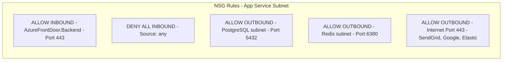
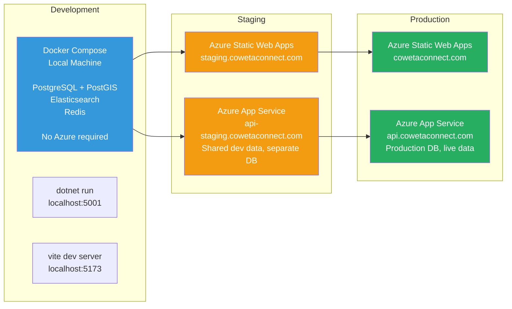
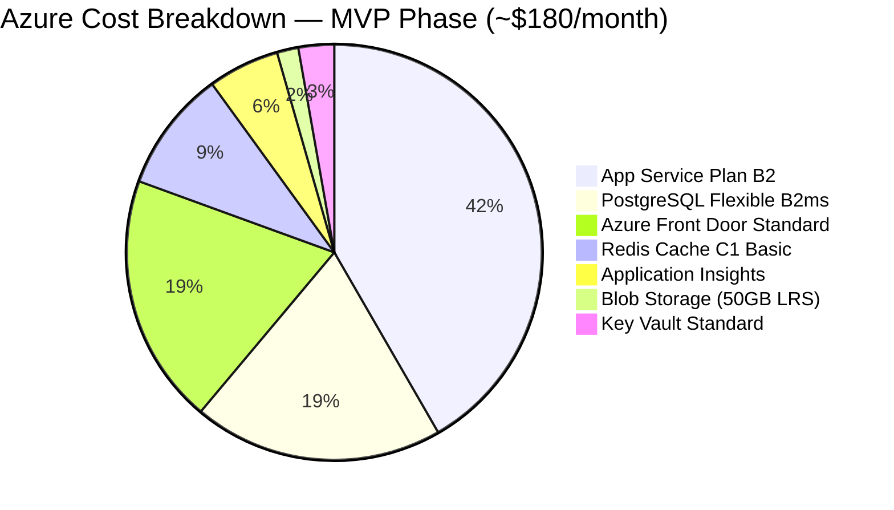

# Deployment & Infrastructure Diagram — CowetaConnect

> **Diagram Type:** Infrastructure / Deployment (Mermaid)  
> **Target:** Microsoft Azure — South Central US region  
> **Last Updated:** 2026-02-18

---

## Full Infrastructure Diagram

```mermaid
graph TB
    classDef user fill:#4A90D9,stroke:#2C5F8A,color:#fff
    classDef edge fill:#F39C12,stroke:#B7770D,color:#fff
    classDef compute fill:#27AE60,stroke:#1A7A42,color:#fff
    classDef data fill:#8E44AD,stroke:#6C3483,color:#fff
    classDef ops fill:#2C3E50,stroke:#1A252F,color:#fff
    classDef ext fill:#7F8C8D,stroke:#5D6D7E,color:#fff
    classDef cicd fill:#E74C3C,stroke:#B03A2E,color:#fff

    subgraph INTERNET["Internet"]
        BROWSER([End User - Browser or Mobile]):::user
        BOT([Search Crawler - Googlebot]):::user
    end

    subgraph AZURE_EDGE["Azure Edge Network"]
        AFD["Azure Front Door Standard - Global CDN, WAF, SSL termination, Rate limiting"]:::edge
    end

    subgraph AZURE_REGION["Azure Region - South Central US"]

        subgraph COMPUTE["Compute Tier"]
            SWA["Azure Static Web Apps - cowetaconnect.com - Vue.js 3 SPA - Free tier"]:::compute
            API["Azure App Service B2/P1v3 - api.cowetaconnect.com - ASP.NET Core 8 - VNET integrated"]:::compute
            HF["Hangfire Workers embedded in App Service - Nightly, Weekly, Hourly jobs"]:::compute
        end

        subgraph DATA["Data Tier - VNET only, no public endpoints"]
            PG["PostgreSQL Flexible Server B2ms - PostgreSQL 16 + PostGIS - 32GB SSD - 7-day PITR backup"]:::data
            ES["Elasticsearch - Elastic Cloud or Azure Marketplace - Version 8.x - businesses and events indexes"]:::data
            RD["Azure Cache for Redis C1 1GB - Version 7 - TLS required - cache only"]:::data
            BLOB["Azure Blob Storage LRS - photos container public CDN - ml-models container private - MI auth"]:::data
        end

        subgraph OPS["Operations and Security"]
            KV["Azure Key Vault Standard - DB conn, Redis conn, JWT key, SendGrid key - Managed Identity access only"]:::ops
            AI["Azure Application Insights - APM, tracing, ML metrics, alerting"]:::ops
            LA["Log Analytics Workspace - 90-day retention - KQL dashboards - Alert rules"]:::ops
            VNET["Azure Virtual Network /16 - App Service subnet - PostgreSQL subnet - Redis and Blob private endpoints"]:::ops
        end

    end

    subgraph EXTERNAL["External Services"]
        GOOGLE["Google OAuth 2.0 - auth.google.com"]:::ext
        SENDGRID["SendGrid - api.sendgrid.com"]:::ext
        MAPBOX["MapBox or OpenStreetMap - api.mapbox.com"]:::ext
        MAXMIND["MaxMind GeoLite2 - Embedded DB file in App Service"]:::ext
    end

    subgraph CICD["CI/CD - GitHub Actions"]
        GH["GitHub Repository - main to Production - develop to Staging"]:::cicd
        GA_API["deploy-api.yml - build, test, publish, deploy, migrate"]:::cicd
        GA_VUE["deploy-vue.yml - npm build, Static Web Apps deploy"]:::cicd
        GA_SEC["security-scan.yml - OWASP check on every PR"]:::cicd
    end

    BROWSER -->|HTTPS| AFD
    BOT -->|HTTPS| AFD
    AFD -->|Static assets cached| SWA
    AFD -->|API requests /api/*| API

    API <-->|Npgsql TCP| PG
    API <-->|HTTPS REST| ES
    API <-->|Redis TCP| RD
    API <-->|Azure SDK HTTPS| BLOB
    API -->|Azure SDK| AI

    HF <-->|EF Core| PG
    HF <-->|Azure SDK| BLOB
    HF -->|Log telemetry| AI

    API -->|OAuth token exchange| GOOGLE
    API -->|Transactional email| SENDGRID
    SWA -->|Map tiles and geocoding| MAPBOX
    API -.->|Local file read - no network call| MAXMIND

    API -->|Read secrets via MI| KV
    API -.->|VNET integrated| VNET
    PG -.->|Private DNS zone| VNET
    RD -.->|Private endpoint| VNET
    BLOB -.->|Private endpoint - ml-models| VNET

    AI --> LA

    GH --> GA_API
    GH --> GA_VUE
    GH --> GA_SEC
    GA_API -->|az webapp deploy| API
    GA_VUE -->|SWA deploy| SWA
```

---

## Network Security Groups (NSG) Rules

---

## Deployment Environments

---

## Availability & Recovery Targets (Phase 1 MVP)

| Resource | SLA | RTO Target | RPO Target |
|---|---|---|---|
| Azure Front Door | 99.99% | — | — |
| Azure App Service (B2) | 99.95% | 15 min | — |
| PostgreSQL Flexible (Burstable) | 99.9% | 30 min | < 5 min (PITR) |
| Redis (Basic C1) | 99.9% | 15 min | N/A (cache) |
| Elasticsearch | Elastic Cloud SLA | 1 hour | Rebuildable from PG |
| Azure Blob Storage (LRS) | 99.9% | 1 hour | Near-zero |
| **Overall Platform** | **~99.9%** | **< 1 hour** | **< 5 min** |

**Phase 3+ upgrade path:** PostgreSQL General Purpose SKU with zone-redundant standby → 99.99% SLA and sub-1-minute failover.

---

## Monthly Cost Estimate

| Resource | SKU | Est. USD/Month |
|---|---|---|
| App Service Plan | B2 (2 core, 3.5 GB) | ~$75 |
| PostgreSQL Flexible Server | Burstable B2ms | ~$35 |
| Azure Front Door | Standard | ~$35 |
| Azure Cache for Redis | C1 Basic (1 GB) | ~$17 |
| Application Insights | Pay-per-use (5GB/month) | ~$10 |
| Blob Storage | LRS Standard 50GB | ~$3 |
| Azure Key Vault | Standard | ~$5 |
| Static Web Apps | Free tier | $0 |
| **Total** | | **~$180/month** |

*Elasticsearch billed separately via Elastic Cloud (~$65/month for 1-node cluster). Total with Elasticsearch: ~$245/month.*

**Scale trigger:** Upgrade App Service to P1v3 (~$145/month) when concurrent users consistently exceed 100 or API response times degrade. PostgreSQL upgrade to General Purpose when DB CPU sustained > 70%.
