# Entity Relationship Diagram — CowetaConnect

> **Diagram Type:** Entity Relationship (Mermaid)  
> **Scope:** All PostgreSQL tables  
> **Last Updated:** 2026-02-18

---

## Full ERD

```mermaid
erDiagram

    %% ─── IDENTITY ───────────────────────────────────────────
    USERS {
        uuid        id              PK
        varchar     email           "UNIQUE NOT NULL"
        varchar     password_hash   "Nullable — OAuth users have none"
        varchar     display_name
        varchar     avatar_url
        varchar     role            "Member | Owner | Admin"
        boolean     is_email_verified
        varchar     google_subject  "Nullable — OAuth identifier"
        timestamptz created_at
        timestamptz last_login
    }

    %% ─── DIRECTORY ──────────────────────────────────────────
    CATEGORIES {
        uuid        id          PK
        varchar     name
        varchar     slug        "UNIQUE"
        varchar     icon
        uuid        parent_id   FK "Self-referential — nullable"
    }

    TAGS {
        uuid        id      PK
        varchar     name
        varchar     slug    "UNIQUE"
    }

    BUSINESSES {
        uuid            id                  PK
        uuid            owner_id            FK
        varchar         name
        varchar         slug                "UNIQUE URL-safe"
        text            description
        uuid            category_id         FK
        varchar         phone
        varchar         email
        varchar         website
        varchar         address_line1
        varchar         city
        char            state               "Default OK"
        varchar         zip
        double_precision lat
        double_precision lng
        geography       location            "PostGIS POINT — computed from lat/lng"
        jsonb           service_area_geojson "Optional polygon"
        boolean         is_active
        boolean         is_verified
        integer         featured_rank       "Nullable — premium placement"
        timestamptz     created_at
        timestamptz     updated_at
    }

    BUSINESS_TAGS {
        uuid    business_id     FK
        uuid    tag_id          FK
    }

    BUSINESS_HOURS {
        uuid        id              PK
        uuid        business_id     FK
        integer     day_of_week     "0=Sun, 1=Mon … 6=Sat"
        time        open_time
        time        close_time
        boolean     is_closed       "True on holidays / closure days"
    }

    BUSINESS_PHOTOS {
        uuid        id              PK
        uuid        business_id     FK
        varchar     blob_url        "Azure CDN URL"
        varchar     caption
        boolean     is_primary
        integer     display_order
        timestamptz uploaded_at
    }

    %% ─── EVENTS ─────────────────────────────────────────────
    EVENTS {
        uuid            id              PK
        uuid            business_id     FK
        uuid            created_by      FK  "FK → users.id"
        varchar         title
        text            description
        varchar         event_type      "Workshop|Market|PopUp|Sale|Class|Meetup|Other"
        timestamptz     start_at
        timestamptz     end_at
        boolean         is_recurring
        varchar         recurrence_rule "iCal RRULE format"
        varchar         address_line1   "May differ from business address"
        varchar         city
        double_precision lat
        double_precision lng
        geography       location        "PostGIS POINT"
        integer         capacity        "Nullable = unlimited"
        boolean         is_free
        numeric         ticket_price
        varchar         ticket_url      "External ticketing link"
        varchar         image_url       "Event banner"
        boolean         is_published
        timestamptz     created_at
    }

    RSVPS {
        uuid        id          PK
        uuid        event_id    FK
        uuid        user_id     FK
        varchar     status      "Going | Maybe | Cancelled"
        timestamptz created_at
        timestamptz updated_at
    }

    %% ─── ANALYTICS ──────────────────────────────────────────
    SEARCH_EVENTS {
        uuid        id                      PK
        varchar     session_hash            "SHA-256 of session — not reversible"
        varchar     keyword
        uuid        category_filter         "Nullable FK → categories.id"
        varchar     city_filter             "Filter the user applied"
        varchar     user_city               "Geolocated origin — NO IP stored"
        varchar     user_zip
        integer     result_count
        uuid_array  result_business_ids     "Array of returned IDs"
        uuid        clicked_business_id     "Nullable — which result was clicked"
        timestamptz occurred_at
    }

    DEMAND_AGGREGATES {
        uuid        id              PK
        uuid        business_id     FK
        varchar     demand_city     "City where searches originated"
        varchar     demand_zip
        float       demand_city_lat "Centroid for distance calculation"
        float       demand_city_lng
        integer     search_count    "Searches in period"
        integer     click_count
        numeric     click_through_rate
        numeric     trend_pct       "% change vs prior period"
        date        period_start
        date        period_end
        timestamptz computed_at
    }

    %% ─── ML / LEADS ─────────────────────────────────────────
    LEAD_ALERTS {
        uuid        id                  PK
        uuid        business_id         FK
        varchar     demand_city
        numeric     opportunity_score   "0.000 – 1.000 from ML model"
        numeric     confidence          "Model confidence"
        integer     search_count        "Evidence supporting the alert"
        numeric     trend_pct
        text        alert_message       "Human-readable description"
        varchar     status              "New | Viewed | Dismissed"
        timestamptz generated_at
        timestamptz viewed_at           "Nullable"
    }

    %% ─── RELATIONSHIPS ──────────────────────────────────────
    USERS                 ||--o{  BUSINESSES          : "owns (owner_id)"
    USERS                 ||--o{  EVENTS              : "creates (created_by)"
    USERS                 ||--o{  RSVPS               : "makes"

    CATEGORIES            ||--o{  BUSINESSES          : "categorizes"
    CATEGORIES            ||--o{  CATEGORIES          : "parent of (self-ref)"

    BUSINESSES            ||--o{  BUSINESS_TAGS       : "has"
    TAGS                  ||--o{  BUSINESS_TAGS       : "used in"
    BUSINESSES            ||--o{  BUSINESS_HOURS      : "defines hours"
    BUSINESSES            ||--o{  BUSINESS_PHOTOS     : "has photos"
    BUSINESSES            ||--o{  EVENTS              : "hosts"
    BUSINESSES            ||--o{  DEMAND_AGGREGATES   : "analyzed by"
    BUSINESSES            ||--o{  LEAD_ALERTS         : "receives"

    EVENTS                ||--o{  RSVPS               : "has RSVPs"
```

---

## Key Index Summary

| Table | Index Name | Type | Columns | Purpose |
|---|---|---|---|---|
| businesses | idx_businesses_location | GIST | location (geography) | Radius search — `ST_DWithin` |
| businesses | idx_businesses_category | B-tree | category_id | Category filter joins |
| businesses | idx_businesses_city | B-tree | city | City filter queries |
| businesses | idx_businesses_slug | Unique B-tree | slug | URL slug lookup |
| businesses | idx_businesses_owner | B-tree | owner_id | Owner dashboard queries |
| events | idx_events_start_at | B-tree | start_at | Calendar date range queries |
| events | idx_events_business_id | B-tree | business_id | Business event listings |
| events | idx_events_city_start | Composite B-tree | city, start_at | City + date queries |
| events | idx_events_location | GIST | location | Proximity event search |
| search_events | idx_se_occurred_at | BRIN | occurred_at | Time-range aggregation scans |
| search_events | idx_se_user_city | B-tree | user_city | City-based analytics grouping |
| demand_aggregates | idx_da_business_period | Composite | business_id, period_start | Trend queries per business |
| lead_alerts | idx_la_business_status | Composite | business_id, status | Dashboard queries for unread alerts |
| rsvps | idx_rsvps_event_user | Unique Composite | event_id, user_id | Prevent duplicate RSVPs |

---

## Data Volume Estimates (Year 1)

| Table | Est. Rows (12 months) | Notes |
|---|---|---|
| users | ~2,000 | Registered owners + active members |
| businesses | ~300 | Coweta / Wagoner County region |
| categories | ~50 | Stable, rarely grows |
| events | ~1,500 | ~5/business/year average |
| rsvps | ~8,000 | |
| search_events | ~500,000 raw → purged to ~200,000 | 90-day rolling |
| demand_aggregates | ~15,000 | ~300 businesses × ~50 city pairs |
| lead_alerts | ~3,000 | ~10 alerts/business/year |

All well within single PostgreSQL Flexible Server capacity with room to grow.
