# ML Pipeline Flow — CowetaConnect Lead Intelligence Engine

> **Diagram Type:** Process Flow (Mermaid)  
> **Scope:** Full lifecycle from user search → lead alert  
> **Last Updated:** 2026-02-18

---

## End-to-End Pipeline Overview

```mermaid
flowchart TD
    classDef user fill:#4A90D9,stroke:#2C5F8A,color:#fff
    classDef api fill:#27AE60,stroke:#1A7A42,color:#fff
    classDef db fill:#8E44AD,stroke:#6C3483,color:#fff
    classDef job fill:#E67E22,stroke:#B85C0D,color:#fff
    classDef ml fill:#E74C3C,stroke:#B03A2E,color:#fff
    classDef output fill:#1ABC9C,stroke:#148F77,color:#fff

    U([👤 User searches\n'honey wagoner ok']):::user
    MW[SearchAnalyticsMiddleware\nIntercepts response]:::api
    GEO[GeoIpResolver\nIP → City/ZIP\nMaxMind GeoLite2]:::api
    SE[(search_events\nPostgreSQL)]:::db
    AGG{Nightly Aggregation Job\nHangfire — 2AM CT}:::job
    DA[(demand_aggregates\nPostgreSQL)]:::db
    RTJ{Weekly Retraining Job\nHangfire — Sunday 2AM CT}:::job
    TRN[LeadScoringTrainer\nML.NET FastTree\nBinary Classifier]:::ml
    EVAL{AUC > 0.72?}:::ml
    MDL[(Model .zip\nAzure Blob Storage)]:::db
    RELOAD[LeadScoringService\nReloadModel\nvia Redis pub/sub]:::ml
    SJ{Weekly Scoring Job\nHangfire — Monday 3AM CT}:::job
    FBB[LeadFeatureBuilder\nMaps agg → feature vector]:::ml
    SCR[LeadScoringService.Score\nPredictionEngine inference]:::ml
    THR{OpportunityScore\n> 0.65?}:::ml
    LA[(lead_alerts\nPostgreSQL)]:::db
    DASH([🏪 Business Owner\nDashboard Alert]):::output

    U --> MW
    MW -->|Fire-and-forget\nMediatR event| GEO
    GEO --> SE

    SE --> AGG
    AGG -->|Computes per-business\nper-city counts + trend| DA
    AGG -->|Purges rows\nolder than 90 days| SE

    DA --> RTJ
    RTJ --> TRN
    TRN -->|Load training data\nfrom demand_aggregates| DA
    TRN --> EVAL
    EVAL -->|Yes| MDL
    EVAL -->|No — keep previous model| ALERT[⚠️ Alert Architect\nSlack + App Insights]:::output

    MDL --> RELOAD

    DA --> SJ
    RELOAD --> SJ
    SJ --> FBB
    FBB --> SCR
    SCR --> THR
    THR -->|Yes| LA
    THR -->|No| DISCARD[Discard — no signal]

    LA --> DASH
```



---

## Stage 1: Search Event Capture

```mermaid
sequenceDiagram
    participant Browser
    participant API as ASP.NET Core API
    participant MW as SearchAnalyticsMiddleware
    participant GEO as GeoIpResolver
    participant REDIS as Redis Cache
    participant MAXMIND as MaxMind GeoLite2
    participant PG as PostgreSQL

    Browser->>API: GET /businesses?q=honey&city=wagoner
    API->>API: Execute search (Elasticsearch)
    API-->>Browser: 200 OK — results

    Note over MW: Middleware fires AFTER response sent — zero added latency

    MW->>GEO: ResolveAsync(requestIp)
    GEO->>REDIS: GET geo:{ip_hash}
    alt Cache hit
        REDIS-->>GEO: { city: "Broken Arrow", zip: "74012" }
    else Cache miss
        GEO->>MAXMIND: City(ipAddress)
        MAXMIND-->>GEO: CityRecord
        GEO->>REDIS: SET geo:{ip_hash} TTL=3600
    end
    GEO-->>MW: GeoLocation { City, Zip }

    MW->>PG: INSERT search_events
    Note over PG: keyword, user_city, user_zip,<br/>result_ids, clicked_id, occurred_at<br/>NO IP ADDRESS STORED
```



---

## Stage 2: Nightly Aggregation Job

```mermaid
flowchart LR
    subgraph Input
        SE[(search_events\nlast 24 hrs)]
    end

    subgraph Aggregation Logic
        G1[GROUP BY\nbusiness_id, user_city]
        C1[COUNT searches\nCOUNT clicks\nCompute CTR]
        T1[Compute trend%\nvs prior 30-day avg]
        D1[Compute distance\nbusiness ↔ demand_city\nHaversine formula]
        CAT[Join category\navg search volume]
        COMP[Count competing\nbusinesses in demand_city]
    end

    subgraph Output
        DA[(demand_aggregates\nUPSERT)]
    end

    subgraph Cleanup
        PURGE[DELETE search_events\nwhere occurred_at < NOW - 90 days]
    end

    SE --> G1 --> C1 --> T1 --> D1 --> CAT --> COMP --> DA
    SE --> PURGE
```



---

## Stage 3: Model Training Pipeline


---

## Stage 4: Lead Scoring & Alert Generation


---

## Feature Vector Reference

| Feature | Source | Type | Notes |
|---|---|---|---|
| `SearchCount30d` | demand_aggregates.search_count | float | Primary demand signal |
| `ClickCount30d` | demand_aggregates.click_count | float | Engagement signal |
| `ClickThroughRate` | click_count / search_count | float | Existing market penetration |
| `TrendPct` | demand_aggregates.trend_pct | float | Growth momentum |
| `DemandCityDistanceKm` | Haversine(business, demand_city) | float | Proximity to opportunity |
| `CategoryAvgSearchVolume` | Computed from all businesses in category | float | Normalizes by category popularity |
| `CompetingBusinessesInDemandCity` | COUNT businesses, same category, in demand_city | float | Market saturation |
| `BusinessAgeDays` | NOW - business.created_at | float | Platform tenure |
| `ExistingEngagement` | Historical CTR from demand_city (prior 90 days) | float | Prior relationship with that market |

---

## Model Monitoring Dashboard (Application Insights)

```mermaid
graph LR
    JOB[Retraining Job\nCompletes] -->|Logs structured event| AI[Azure App Insights]
    AI --> DASH[Custom Dashboard\nMetrics over time]

    DASH --> M1[📊 AUC-ROC per training run]
    DASH --> M2[📊 F1 Score per training run]
    DASH --> M3[📊 Training row count]
    DASH --> M4[📊 Alerts generated per scoring run]
    DASH --> M5[📊 Owner dismiss rate\nfeedback quality proxy]
    DASH --> M6[⏱️ Training duration ms]
```



Structured log emitted on each training run:

```json
{
  "event": "ml_model_trained",
  "model_date": "2026-02-16",
  "training_rows": 4821,
  "auc": 0.812,
  "f1": 0.741,
  "precision": 0.778,
  "recall": 0.707,
  "deployed": true,
  "duration_ms": 3241
}
```
