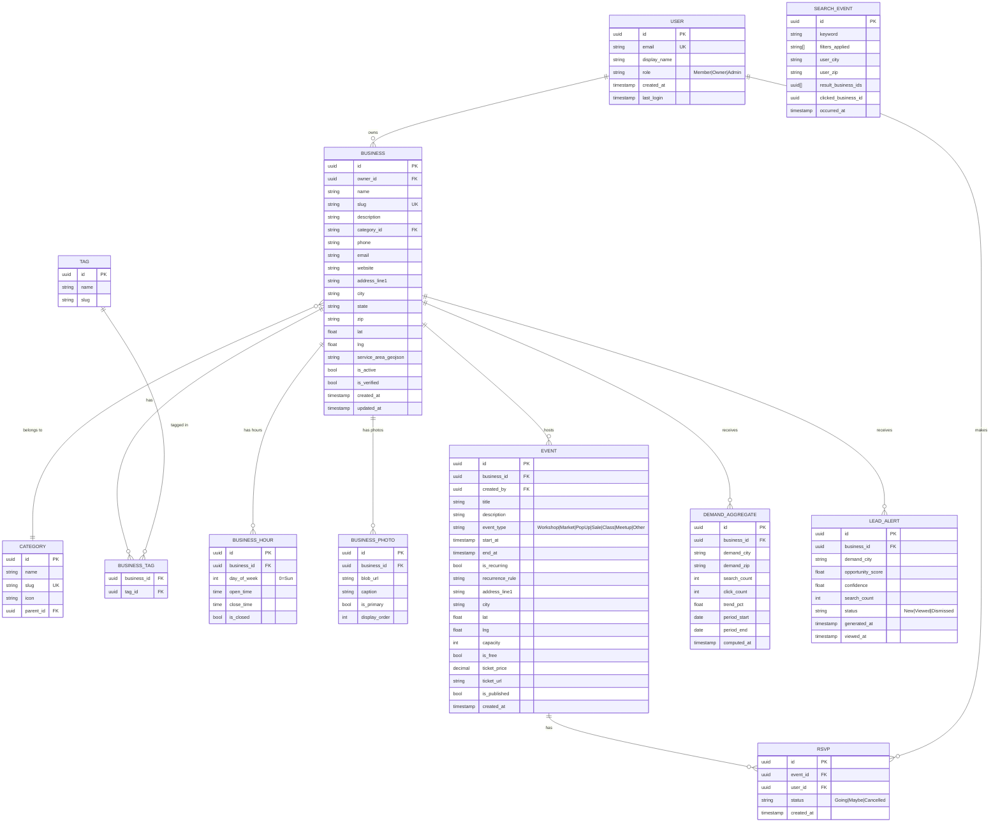

# Data Model — CowetaConnect

> **Document Type:** Data Architecture  
> **Version:** 1.0.0

---

## Entity Relationship Overview (Mermaid)



---

## Table Definitions

### `users`

| Column | Type | Notes |
|---|---|---|
| id | UUID | PK, gen_random_uuid() |
| email | VARCHAR(320) | Unique, normalized |
| password_hash | VARCHAR | Nullable (OAuth users) |
| display_name | VARCHAR(100) | |
| avatar_url | VARCHAR | |
| role | VARCHAR(20) | Member / Owner / Admin |
| is_email_verified | BOOLEAN | Default false |
| google_subject | VARCHAR | For OAuth, nullable |
| created_at | TIMESTAMPTZ | |
| last_login | TIMESTAMPTZ | |

### `businesses`

| Column | Type | Notes |
|---|---|---|
| id | UUID | PK |
| owner_id | UUID | FK → users.id |
| name | VARCHAR(200) | |
| slug | VARCHAR(220) | Unique, URL-safe |
| description | TEXT | |
| category_id | UUID | FK → categories.id |
| phone | VARCHAR(20) | |
| email | VARCHAR(320) | |
| website | VARCHAR | |
| address_line1 | VARCHAR(200) | |
| city | VARCHAR(100) | |
| state | CHAR(2) | Default 'OK' |
| zip | VARCHAR(10) | |
| lat | DOUBLE PRECISION | |
| lng | DOUBLE PRECISION | |
| location | GEOGRAPHY(POINT) | PostGIS, computed from lat/lng |
| service_area_geojson | JSONB | Optional service radius polygon |
| is_active | BOOLEAN | Owner can deactivate |
| is_verified | BOOLEAN | Admin-verified listing |
| featured_rank | INTEGER | For premium placement, null = not featured |
| created_at | TIMESTAMPTZ | |
| updated_at | TIMESTAMPTZ | |

**Indexes:**
- `idx_businesses_location` — GIST index on `location` for radius searches
- `idx_businesses_category` — B-tree on `category_id`
- `idx_businesses_city` — B-tree on `city`
- `idx_businesses_slug` — Unique B-tree on `slug`

### `events`

| Column | Type | Notes |
|---|---|---|
| id | UUID | PK |
| business_id | UUID | FK → businesses.id |
| created_by | UUID | FK → users.id |
| title | VARCHAR(300) | |
| description | TEXT | |
| event_type | VARCHAR(30) | Enum-like |
| start_at | TIMESTAMPTZ | |
| end_at | TIMESTAMPTZ | |
| is_recurring | BOOLEAN | |
| recurrence_rule | VARCHAR | iCal RRULE format |
| address_line1 | VARCHAR(200) | May differ from business address |
| city | VARCHAR(100) | |
| lat | DOUBLE PRECISION | |
| lng | DOUBLE PRECISION | |
| location | GEOGRAPHY(POINT) | PostGIS |
| capacity | INTEGER | Null = unlimited |
| is_free | BOOLEAN | |
| ticket_price | NUMERIC(8,2) | |
| ticket_url | VARCHAR | External ticketing link |
| image_url | VARCHAR | Event banner image |
| is_published | BOOLEAN | Draft / Published |
| created_at | TIMESTAMPTZ | |

**Indexes:**
- `idx_events_start_at` — B-tree on `start_at` (calendar queries)
- `idx_events_business_id` — B-tree on `business_id`
- `idx_events_city_start` — Composite on `city, start_at`

### `search_events` (Analytics)

> **Privacy Note:** No user IDs or personal info stored. Only aggregate geography (city, ZIP) derived from IP geolocation.

| Column | Type | Notes |
|---|---|---|
| id | UUID | PK |
| session_hash | VARCHAR(64) | SHA-256 of session token, no reversibility needed |
| keyword | VARCHAR(500) | |
| category_filter | UUID | FK → categories.id, nullable |
| city_filter | VARCHAR(100) | Filter user applied |
| user_city | VARCHAR(100) | Geolocated origin city |
| user_zip | VARCHAR(10) | Geolocated origin ZIP |
| result_count | INTEGER | |
| result_business_ids | UUID[] | Array of returned business IDs |
| clicked_business_id | UUID | Nullable, which result was clicked |
| occurred_at | TIMESTAMPTZ | |

**Indexes:**
- `idx_search_events_keyword` — GIN on `to_tsvector(keyword)` (for keyword aggregation)
- `idx_search_events_occurred_at` — BRIN on `occurred_at` (time-range scans)
- `idx_search_events_user_city` — B-tree on `user_city`

### `demand_aggregates`

Pre-computed by nightly aggregation job. Powers the ML model and dashboards.

| Column | Type | Notes |
|---|---|---|
| id | UUID | PK |
| business_id | UUID | FK → businesses.id |
| demand_city | VARCHAR(100) | Where searches originate |
| demand_zip | VARCHAR(10) | |
| search_count | INTEGER | Count of search events in period |
| click_count | INTEGER | Count of actual clicks |
| click_through_rate | NUMERIC(5,4) | click_count / search_count |
| trend_pct | NUMERIC(8,2) | % change vs prior period |
| period_start | DATE | |
| period_end | DATE | |
| computed_at | TIMESTAMPTZ | |

### `lead_alerts`

| Column | Type | Notes |
|---|---|---|
| id | UUID | PK |
| business_id | UUID | FK → businesses.id |
| demand_city | VARCHAR(100) | |
| opportunity_score | NUMERIC(4,3) | 0.000 – 1.000 |
| confidence | NUMERIC(4,3) | Model confidence |
| search_count | INTEGER | Supporting evidence count |
| alert_message | TEXT | Human-readable description |
| status | VARCHAR(20) | New / Viewed / Dismissed |
| generated_at | TIMESTAMPTZ | |
| viewed_at | TIMESTAMPTZ | Nullable |

---

## Elasticsearch Index Schemas

### `businesses` index

```json
{
  "mappings": {
    "properties": {
      "id": { "type": "keyword" },
      "name": { 
        "type": "text",
        "analyzer": "english",
        "fields": { "keyword": { "type": "keyword" } }
      },
      "description": { "type": "text", "analyzer": "english" },
      "category_name": { "type": "keyword" },
      "tags": { "type": "keyword" },
      "city": { "type": "keyword" },
      "zip": { "type": "keyword" },
      "location": { "type": "geo_point" },
      "is_active": { "type": "boolean" },
      "is_verified": { "type": "boolean" },
      "featured_rank": { "type": "integer" }
    }
  }
}
```

### `events` index

```json
{
  "mappings": {
    "properties": {
      "id": { "type": "keyword" },
      "title": { "type": "text", "analyzer": "english" },
      "description": { "type": "text", "analyzer": "english" },
      "event_type": { "type": "keyword" },
      "start_at": { "type": "date" },
      "city": { "type": "keyword" },
      "location": { "type": "geo_point" },
      "is_free": { "type": "boolean" },
      "business_name": { "type": "keyword" }
    }
  }
}
```

---

## Data Retention Policy

| Table | Retention | Reason |
|---|---|---|
| search_events | 90 days raw | Privacy; aggregated before expiry |
| demand_aggregates | 2 years | Trend analysis |
| lead_alerts | 1 year | Business history |
| rsvps | Indefinite | Attendance records |
| business/event data | Indefinite | Core application data |
